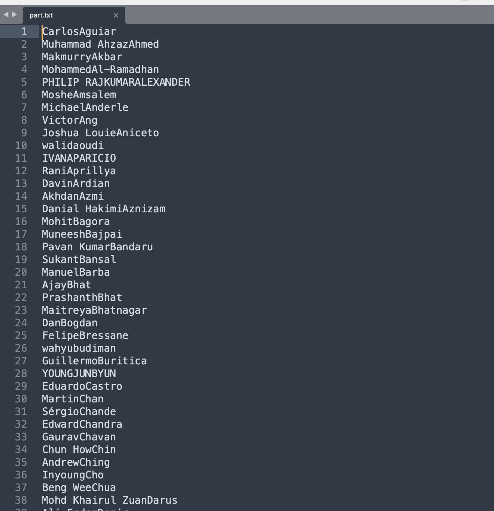
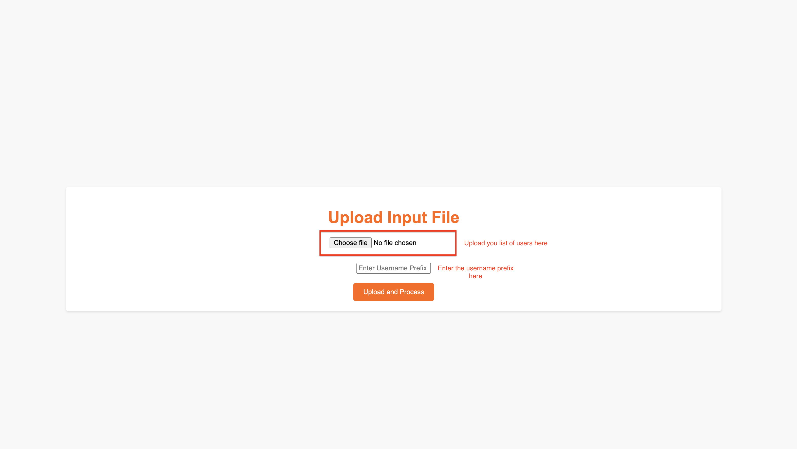
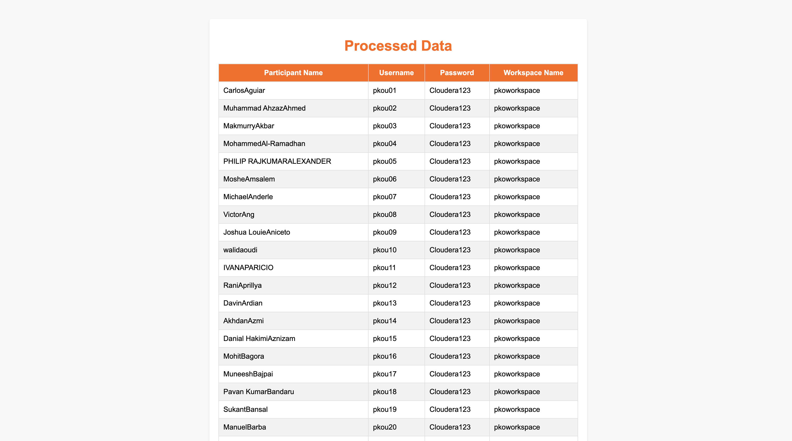

# WorkshopUserAssignment

This script helps you to perform user assignment for virtual workshops.

The input is a text file with the first name and last name in new line.

Run the app.py using

> python3 app.y

Open the URL http://127.0.0.1:5000 on a browser and upload the txt file with all the user names.

SAMPLE INPUT FILE

HOMEPAGE

OUTPUT

